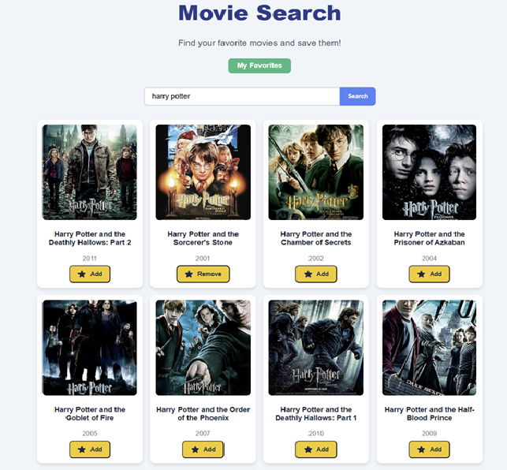
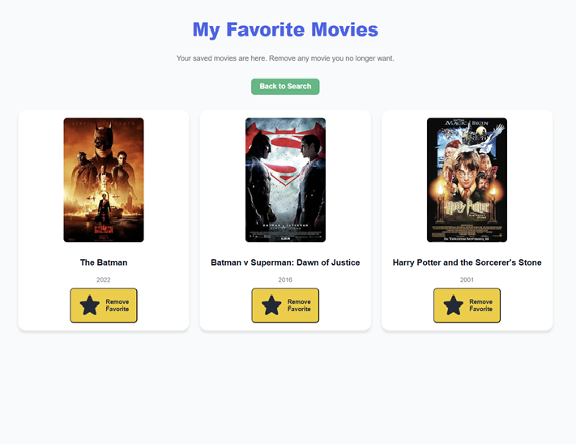

# Movie Watchlist Application

A web application that allows users to **search movies**, **save favorites**, and manage their personal watchlist. The app uses **Next.js** for the frontend and **NestJS** for the backend, with **OMDb API** for movie data.

---

## **Table of Contents**

1. [Overview](#overview)
2. [Features](#features)
3. [Screenshots](#screenshots)
4. [Frontend Routes & Pages](#frontend-routes--pages)
5. [Backend Routes & APIs](#backend-routes--apis)
6. [Data Storage](#data-storage)
7. [Tech Stack](#tech-stack)
8. [Deployment](#deployment)
9. [Setup](#setup)

---

## **Overview**

The app allows users to:

- Search movies using the OMDb API.
- Add or remove movies to a personal favorites list.
- View a grid of favorite movies.
- Infinite scrolling for search results.
- Store favorites in **localStorage** so the favorites persist between sessions.

---

## **Screenshots**

### Movie Search Page



### Favorites Page



---

## **Features**

- **Favorites Storage**: Chose **localStorage** for simplicity and persistence across page reloads. No backend storage for favorites.
- **Infinite Scrolling**: Implemented using React Query's `useInfiniteQuery` for search results.
- **Frontend-Only Features**:
  - Favorites list is fully client-side.
  - Search uses backend to fetch movie data from OMDb API.
- **Styling**: Used **CSS Modules** (`Home.module.css`) for better control and simplicity.
- **UI/UX**:
  - Grid display of movies with 3–4 columns per row.
  - Placeholder images for missing posters.
  - Favorite toggle button with star icon.
  - Responsive and mobile-friendly layout.

---

## **Frontend Routes & Pages**

| Route                | Description                                        |
|---------------------|----------------------------------------------------|
| `/`                  | Home/Search page with movie search functionality. |
| `/favorites`         | Displays list of favorite movies from localStorage. |

---

## **Backend Routes & APIs**

| Method | Route                       | Description                                    |
|--------|-----------------------------|------------------------------------------------|
| GET    | `/movies/search?q=<query>&page=<number>` | Searches movies using the OMDb API. |

> **Note:** There is **no backend route for favorites**, as it is stored in **localStorage** on the client.

---

## **Data Storage**

- **Favorites**: Stored in browser **localStorage** under the key `"favorites"`.
- Example helper functions:

```ts
// utils/localFavorites.ts
export const getFavoritesFromStorage = (): Movie[] => {
  if (typeof window === 'undefined') return [];
  const data = localStorage.getItem(FAVORITES_KEY);
  return data ? JSON.parse(data) : [];
}

export const saveFavoritesToStorage = (movies: Movie[]) => {
  localStorage.setItem(FAVORITES_KEY, JSON.stringify(movies));
}

export const addFavoriteToStorage = (movie: Movie) => {
  const favorites = getFavoritesFromStorage();
  const exists = favorites.find(f => f.imdbID === movie.imdbID);
  if (!exists) {
    favorites.push(movie);
    saveFavoritesToStorage(favorites);
  }
}

export const removeFavoriteFromStorage = (imdbID: string) => {
  let favorites = getFavoritesFromStorage();
  favorites = favorites.filter(f => f.imdbID !== imdbID);
  saveFavoritesToStorage(favorites);
}

```

---

## **Tech Stack**

- **Frontend**:
  - Next.js
  - React
  - TypeScript
  - CSS Modules
  - React Query
  - Heroicons

- **Backend**:
  - NestJS
  - Axios for OMDB API requests
  - TypeScript

- **External API**:
  - OMBD API

--- 

## **Deployment**
- **Frontend (Next.js)**:

   - Can be deployed to Vercel, Netlify, or AWS Amplify.

   - Configure environment variables for the OMDb API key.

   - Enable HTTPS for secure API requests.

   - Use React Query Devtools only in development.

- **Backend (NestJS)**:

   - Deploy on Heroku, Render, AWS Elastic Beanstalk, or Docker containers.

   - Set environment variables for the OMDb API key.

   - Enable CORS for frontend domain(s).

   - Rate-limit requests to avoid exceeding OMDb API limits.

- **Security & Best Practices**:

   - Do not store API keys in frontend code. Proxy API requests through backend.

   - Validate query parameters in backend.

   - Use HTTPS in production.

   - Add error handling for API failures and empty results.

--- 

## **Setup**:

1. Clone Repository:

```bash
git clone <repo-url>
cd movie-watchlist
```

2. Backend:

```bash
cd backend
npm install
create .env file
# set OMDB_API_KEY in .env
npm run start:dev 
```

3. Frontend:

```bash
cd frontend
npm install
npm run dev
```

4. Open http://localhost:3000 in browser.

---